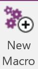

A Onetastic macro for sorting pages and adding a sortable date prefix


## Installation

1. Install [Onetastic](https://getonetastic.com/).
2. Click *New Macro* in the ribbon:

  
3. Click *Edit XML*:


4. Paste in the XML below anc click "Ok"


```
    <?xml version="1.0" encoding="utf-16"?>
    <Macro name="Sort &amp; Add Sortable Date" category="Sort" description="Sorts all of the pages within a section, and if they don't have a date sortable prefix, it adds one. This makes a page have a name like &quot;2016-08-09 My Page&quot;." publishDate="00-00-00T00:00:00.000Z" version="12">
      <Expression>$CurrentSection = GetCurrentSection()</Expression>
      <Expression>$Pages = $CurrentSection.pages</Expression>
      <Expression>SortObjects($Pages, "dateTime", true)</Expression>
      <ForEach var="Page">
        <Array>$Pages</Array>
        <Expression>$AllText = QueryObjects("Text", $Page)</Expression>
        <Expression>$TitleText = Array_PopFront($AllText)</Expression>
        <If>
          <Condition>String_StartsWith($TitleText.value, 20, true)</Condition>
          <Expression>""</Expression>
        </If>
        <Else>
          <Expression>$SortableDate = (DateTime_Year($Page.dateTime) &amp; "-")</Expression>
          <Expression>$SortableDate &amp;= (DateTime_Month($Page.dateTime) &amp; "-")</Expression>
          <Expression>$SortableDate &amp;= DateTime_Day($Page.dateTime)</Expression>
          <Expression>$TitleText.value = (($SortableDate + " ") + $TitleText.value)</Expression>
        </Else>
      </ForEach>
    </Macro>
```

5. Click Save


6. Your macro is now ready for use. Enjoy!


